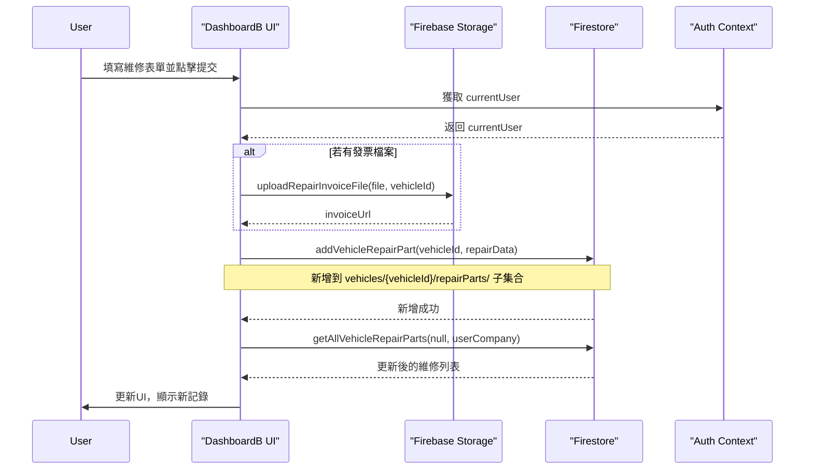
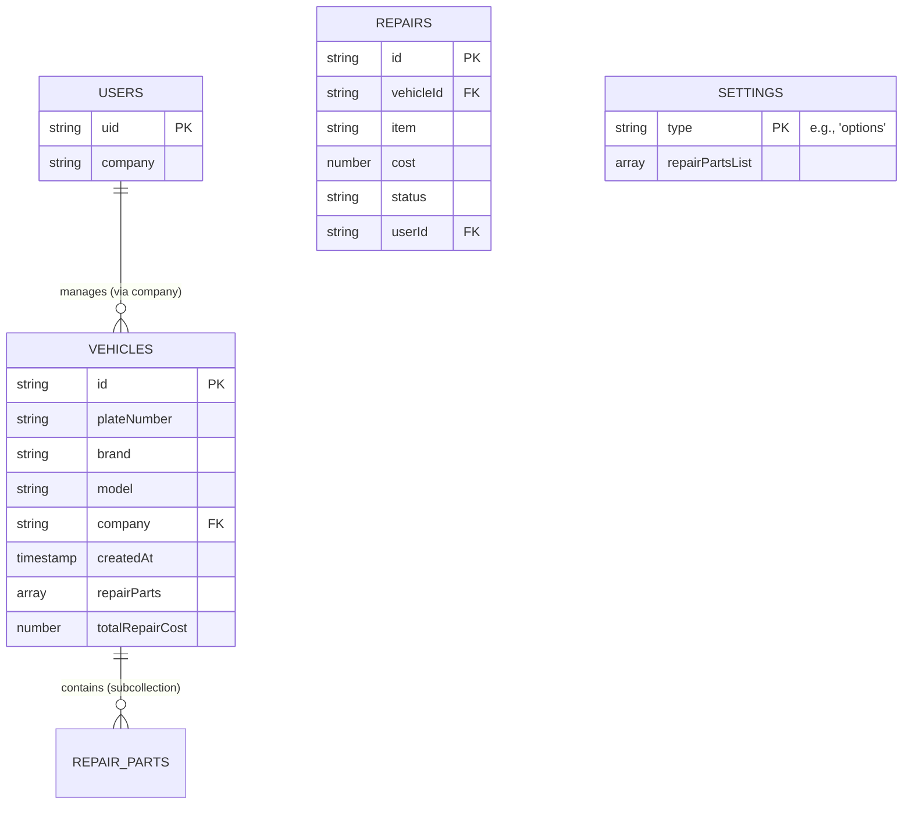

# 規格文件 (spec.md)

## 1. 專案概觀

本專案為一個基於Firebase的車輛信息管理系統，使用React、TailwindCSS和Material UI構建，支持PWA功能，可在手機和電腦上使用。系統使用 React 作為前端框架，Firebase (Firestore, Firebase Storage, Firebase Authentication) 作為後端服務。該系統設計用於管理車輛資料、維修記錄及相關費用，並提供豐富的搜尋與篩選功能。

## 2. 主要功能與模組

*   **用戶認證系統**:
    *   用戶可以透過電子郵件和密碼登入系統。
    *   基於角色的權限控制 (A、B、C權限)。
    *   登入成功後根據用戶角色顯示對應界面。
    *   用戶可以登出。

*   **車輛入庫管理模組（權限A - DashboardA）**:
    *   新增車輛資料。
    *   記錄入庫日期與來源。
    *   執行入庫檢查步驟（可自定義檢查清單）。
    *   更新車輛狀態（例如：在庫／已售等）。
    *   車輛資訊欄位包含：廠牌、車型、車牌、年份、顏色、CC數、配備、類別、位置、收訂日期、備註等。

*   **維修與花費管理模組（權限B - DashboardB）**:
    *   顯示當前登入用戶所屬公司的車輛列表。
    *   提供車輛搜尋功能 (依車牌、品牌、型號)。
    *   提供車輛篩選功能 (依狀態、品牌、型號)。
    *   為特定車輛新增維修紀錄到車輛子集合（維修項目、地點、時間、料號、費用）。
    *   可上傳維修發票或照片（存入 Firebase Storage，使用車輛特定路徑）。
    *   顯示每台車輛的維修項目數及相關費用 (已付款、未付款、總金額)。
    *   允許用戶點擊車牌查看及編輯該車輛的詳細維修項目 (維修部位、金額)。
    *   顯示待處理及已完成的維修項目列表。
    *   自動彙總各車輛總花費（從車輛子集合計算）。
    *   支援維修狀態即時更新（待處理 ↔ 已完成）。

*   **車輛總覽與篩選模組（權限C - DashboardC）**:
    *   顯示所有車輛清單（支援分頁）。
    *   提供多樣化的 Filter 選項：例如廠牌、車型、年份、顏色、價格區間、在庫狀態等。
    *   提供關鍵字搜尋功能：可搜尋車牌號碼或備註欄位。
    *   允許用戶點選任一車輛，以進入該車輛的詳細資訊頁面（包含完整的入庫與維修資訊）。
    *   允許新增、編輯及標記車輛為已售出。

*   **車輛列表 (VehicleList)**: 
    *   彈性顯示車輛數據的組件，可與不同儀表板集成。
    *   支持多種篩選和排序選項。

## 3. 數據模型 (Firestore Conceptual)

*   **users**:
    *   `uid` (String): 用戶唯一ID
    *   `company` (String): 用戶所屬公司
    *   ... (其他用戶相關資訊)
*   **vehicles**:
    *   `plateNumber` (String): 車牌號碼
    *   `brand` (String): 品牌
    *   `model` (String): 型號
    *   `status` (String): 狀態 (e.g., "active", "draft")
    *   `company` (String): 所屬公司
    *   `sold` (Boolean): 是否已售出
    *   `createdAt` (Timestamp): 建立時間
    *   `repairParts` (Array of Objects): 維修項目列表
        *   `part` (String): 維修部位
        *   `cost` (Number): 金額
    *   `totalRepairCost` (Number): 總維修金額
    *   ... (其他車輛相關資訊)
    *   **repairParts** (Subcollection): 車輛維修部件子集合
        *   `item` (String): 維修項目/部位
        *   `location` (String): 維修地點
        *   `date` (String): 維修日期
        *   `partNumber` (String): 料號
        *   `cost` (Number): 費用
        *   `status` (String): 維修狀態 (e.g., "pending", "done")
        *   `invoiceUrl` (String): 發票/照片URL (Firebase Storage，路徑：vehicles/{vehicleId}/repairs/)
        *   `userId` (String): 操作用戶ID
        *   `createdAt` (Timestamp): 記錄建立時間
        *   `updatedAt` (Timestamp): 記錄更新時間
*   **repairs** (舊結構，已棄用):
    *   ~~此 collection 已被車輛子集合 repairParts 取代~~
    *   ~~維修資料現在直接隸屬於對應的車輛文檔~~

### 3.1 當前實作架構說明

**當前資料儲存方式**：系統目前採用車輛文檔內的 `repairParts` 陣列來儲存維修記錄，而非使用子集合架構。這個設計決定是基於以下考量：

1. **簡化權限控制**：避免了 Firestore 安全規則中子集合路徑的複雜性問題
2. **查詢效能**：減少跨集合查詢，提升資料讀取效能
3. **資料一致性**：維修記錄直接與車輛文檔綁定，降低資料不一致風險
4. **開發便利性**：簡化前端資料處理邏輯

**DashboardB 車牌點擊功能實作**：
- 點擊車牌號碼時，系統從 `repairs` 狀態陣列中篩選該車輛的維修記錄
- 維修記錄以扁平化方式從車輛的 `repairParts` 陣列載入到 `repairs` 狀態
- 支援即時切換付款狀態（pending ↔ done）
- 提供已付款、未付款和總金額的即時統計

**技術架構彈性**：
- 維修子集合工具函數（`firestoreVehicleRepairs.js`）已完成開發，可在需要時切換至子集合架構
- Firestore 安全規則已修正，支援子集合路徑存取
- 當前實作可無縫遷移至子集合架構
*   **settings**:
    *   `options` (Document):
        *   `repairParts` (Array of Strings): 預設維修部位選項列表

## 4. UML 圖表 (文字描述與 Mermaid 語法)

### 4.1 使用案例圖 (Use Case Diagram)

*   **參與者 (Actor)**:
    *   一般用戶 (User)
*   **使用案例 (Use Cases)**:
    *   登入系統
    *   查看車輛列表 (依公司或全部)
    *   搜尋車輛
    *   篩選車輛
    *   新增車輛資料 (DashboardC)
    *   編輯車輛資料 (DashboardC)
    *   標記車輛為已售出 (DashboardC)
    *   查看車輛維修費用 (DashboardB)
    *   新增車輛維修記錄 (DashboardB)
    *   編輯車輛維修項目 (DashboardB)
    *   更新維修記錄狀態 (DashboardB)
    *   上傳維修發票/照片 (DashboardB)

### 4.2 高階流程圖 (範例: DashboardB 車輛與維修資料載入)

1.  用戶導航至 DashboardB。
2.  系統驗證用戶是否登入 (`useAuth` context)。
3.  若已登入，非同步執行以下操作：
    a.  透過 `currentUser.uid` 查詢 `users` 集合，獲取用戶的 `company`。
    b.  查詢 `vehicles` 集合，依 `createdAt` 降序排列。
    c.  客戶端過濾車輛，僅保留 `vehicle.company` 與用戶公司相符的車輛。
    d.  從過濾後的車輛數據中提取唯一的品牌 (`uniqueBrands`) 和型號 (`uniqueModels`) 用於篩選器。
    e.  更新 `vehicles`, `filteredVehicles`, `brands`, `models` 狀態。
    f.  **當前實作**：直接從車輛文檔的 `repairParts` 陣列中扁平化維修記錄到 `repairs` 狀態。
    g.  查詢 `settings/options` 文件，獲取 `repairParts` 維修部位列表。
4.  系統根據 `repairs` 狀態中的維修資料計算每台車的已付、未付及總維修費用。
5.  UI 渲染車輛列表、維修費用、篩選器及維修記錄相關區塊。
6.  用戶可透過搜尋框及篩選器與列表互動，`useEffect` 鉤子會監聽相關狀態變化並更新 `filteredVehicles`。

**車牌點擊功能流程**：
1.  用戶點擊車牌號碼。
2.  系統從 `repairs` 狀態中篩選該車輛的維修記錄。
3.  將維修記錄轉換為模態框所需的格式。
4.  彈出維修清單模態框，顯示維修項目、金額和付款狀態。
5.  用戶可在模態框中切換付款狀態，系統即時更新並重新載入資料。

### 4.3 循序圖 (範例: DashboardB 新增維修記錄)



### 4.4 實體關係圖 (Conceptual ERD for Firestore)


(注意: Firestore 是 NoSQL，此處 ERD 為概念表示，`SETTINGS` 是一個假設的集合用於存儲如 `repairPartsList` 的全局選項)

## 5. 技術棧

*   **前端**：React with Vite
*   **樣式**：TailwindCSS, Material UI
*   **後端/資料庫**：Firebase（Authentication, Firestore, Storage）
*   **部署**：Firebase Hosting
*   **PWA 支援**：Service Worker, 離線功能, 手機裝置支援
*   **狀態管理**: React Context API (`AuthContext`), `useState`
*   **路由**: `react-router-dom`
*   **GraphQL (潛在)**: Firebase Data Connect (如 `dataconnect/` 目錄所示)

## 6. 檔案結構及執行流程

```
├── src/                  # 源代碼
│   ├── pages/            # 不同頁面的React組件
│   │   ├── DashboardA.jsx  # 入庫管理介面(權限A)
│   │   ├── DashboardB.jsx  # 維修管理介面(權限B)
│   │   ├── DashboardC.jsx  # 車輛總覽介面(權限C)
│   │   ├── Login.jsx       # 登入頁面
│   │   └── VehicleList.jsx # 車輛列表組件
│   ├── components/       # 可重用組件
│   │   ├── AppIcons.jsx    # 應用圖標組件
│   │   └── ModelCCSelector.jsx # 車型和CC值選擇器
│   ├── utils/            # 工具函數
│   │   ├── firebaseStorage.js # Firebase Storage操作
│   │   ├── firestoreModelCC.js # 品牌車型CC相關操作
│   │   └── firestoreRepairs.js # 維修相關數據操作
│   ├── contexts/         # Context提供器
│   │   └── AuthContext.jsx # 認證上下文
│   ├── App.jsx           # 主應用程序組件
│   ├── firebase.js       # Firebase配置
│   ├── index.css         # 全局樣式
│   ├── config.js         # 系統配置
│   └── main.jsx          # 應用程序入口點
```

### 6.1 程式執行流程

1. **程式入口點**：
   - `main.jsx` - 應用程序入口點，初始化React應用並註冊Service Worker。
   - `App.jsx` - 主應用元件，設置路由並包含`AuthProvider`。

2. **用戶登入流程**：
   - 用戶進入應用後，`AuthContext`檢查登入狀態。
   - 未登入用戶被導向登入頁面。
   - 用戶輸入郵箱和密碼，點擊登入按鈕。
   - `Login.jsx`執行`handleSubmit`函數，調用`AuthContext`的`login`方法。
   - 登入成功後，`onAuthStateChanged`監聽器被觸發。
   - 系統透過`fetchUserByEmail`函數檢查用戶在Firestore的文檔。
   - 如用戶文檔存在：加載用戶角色和公司信息。
   - 如用戶文檔不存在：創建新用戶記錄，設置默認權限 (通常為C權限)。
   - 用戶被導航到首頁，根據權限顯示相應的界面。

3. **權限與路由**：
   - `App.jsx`根據用戶角色顯示對應界面切換選項(A、B或C)。
   - 用戶可點擊界面按鈕切換不同模組，或使用`logout`功能登出。

### 6.2 用戶角色與權限

- **A權限**：入庫管理模組，可新增和編輯車輛資料。
- **B權限**：維修管理模組，可記錄維修項目、費用和上傳發票。
- **C權限**：車輛總覽模組，查看所有車輛信息和篩選功能。

## 7. Firebase 資料結構詳解

### Collections

1. **vehicles**
   - 儲存所有車輛基本資訊
   - 欄位：brand, model, plateNumber, year, color, cc, equipment, category, location, deposit, notes, status, createdAt, updatedAt

2. **repairs**
   - 儲存所有維修紀錄
   - 欄位：vehicleId, item, location, date, partNumber, cost, status, invoiceUrl, createdAt

3. **settings/brands/models**
   - 儲存品牌和車型資料
   - 結構：
     ```
     settings/
       brands/
         models/
           {brandId}/
             model_list/
               {modelId}/
                 ccs: [cc1, cc2, ...]
     ```

4. **settings/options**
   - 儲存系統選項設定
   - 欄位：colors, types, years, repairParts

5. **users**
   - 儲存使用者資訊
   - 欄位: uid, email, role, company

